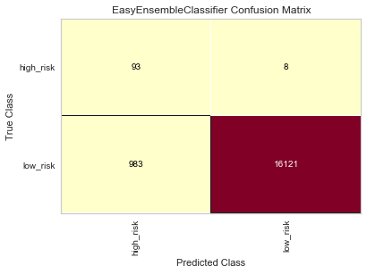

# Predicting Credit Risk: Lending Club Data

Using the free 2019 first quarter loan data from Lending Club, this exercise takes a look at various machine learning models to predict credit risk, and compare their performance. Logistic regression and ensemble learning are the two machine learning classifiers employed in this exercise.

After resampling the imbalanced loan data set, the `LogisticRegression` algorithm from Scikit-learn library was used. Four resampling techniques used include:
* `RandomOverSampler`
* `SMOTE`
* `ClusterCentroids`
* `SMOTEENN`

For ensemble learning, the following algorithm classifiers from imbalanced-learn were used:
* `BalancedRandomForestClassifier`
* `EasyEnsembleClassifier`

----

## **Preparing the Data for Training**
To classify the risk, the `loan_status` column was transformed to a binary field - `low_risk` and `high_risk`. Any loan with a `Current` status is classified as having low risk. Loans that are either `Late (31-120 days)`, `Late (16-30 days)`, in `Default` or `In Grace Period` are classfied as having high risk.

After cleaning the data, dropping nulls and re-classifying the `loan_status` column, the dataframe yielded:
```
68817 rows × 86 columns
```

### **Encoding Categorical Data**

To account for the effects of categorical variables, they were encoded to numerical values. By using the `select_dtypes` function and excluding any non-numbers, 10 columns (including the target 'loan_status`) were identified to be categorical. Listing their unique values helped in choosing an encoding method.

```
df_cat = df.select_dtypes(exclude=[np.number])
pd.Series((df[col].unique() for col in df_cat.columns),index=df_cat.columns)
```

```
home_ownership                         [RENT, MORTGAGE, OWN, ANY]
verification_status     [Source Verified, Verified, Not Verified]
issue_d                            [Mar-2019, Feb-2019, Jan-2019]
loan_status                                 [low_risk, high_risk]
pymnt_plan                                                    [n]
initial_list_status                                        [w, f]
next_pymnt_d                                 [May-2019, Apr-2019]
application_type                          [Individual, Joint App]
hardship_flag                                                 [N]
debt_settlement_flag                                          [N]
dtype: object
```

Three features (`pymnt_plan`, `hardship_flag`, `debt_settlement_flag` ) are seemingly binary, but each of them only had one unique value - `No`. Two features (`issue_d`, `next_pymnt_d`) returned date values. The remaining 4 non-numerical non-target features (`home_ownership`, `verification_status`, `initial_list_status`, `application_type`) have multiple unique values. Since the binary fields only had one unique value - `No`, and to avoid specifying any heirarchy on the date features, we can choose to uniformly encode the non-target data using the `get_dummies` function.

```
df_encoded = pd.get_dummies(df, columns= df_cat.drop(columns="loan_status").columns)
```

### **Scaling the Data**
Data was not scaled prior to training as it is not required. The default solver, `liblinear`, used for logistic regression handles unscaled data. The tree-based models used for ensemble learning are not distance based and can handle varying ranges of data, hence it is not required.

### **Class Imbalance and Splitting the Data**
Executing the above codes transformed the data and yielded:
```
68817 rows × 96 columns
```
We see an imbalanced binary data set - 68,817 data points split into 347 `high_risk` and 68,470 `low_risk`. To address the imbalance, as laid out in later sections, we employed re-sampling techniques.


Using the `train_test_split` from Sci-kit learn, we get the following split between training and testing data:

```
Train data: Counter({'low_risk': 51366, 'high_risk': 246})
Test Data: Counter({'low_risk': 17104, 'high_risk': 101})
```


----


## **Model Evaluation Metrics**

The three primary metrics we will be looking at to evaluate our models are:
* Recall Score
* Balanced Accuracy Score
* Geometric Mean Score

Across these metrics, the closer they are to 1 the better.

### **Precision vs Recall**
Due to the nature of the data and the objective of the analysis, we will be paying more attention to recall as opposed to precision. In predicting credit risk of a loan, recall is a preferrable measure to precision - one would rather predict that the loan is high-risk when it is actually low-risk (False Negative) than predict it is low-risk when it actually is high-risk (False Positive). However, to round out the analysis, we will be looking at precision score and the trade-off between recall and precision via the F1-score in the deep-dive analysis of each technique.


### **Accuracy Scores**
The other metric we want to pay attention to is **specificity**. Essentially the inverse of recall, it tells how good the model is at predicting high-risk loans when they actually are (True Negative).


To provide us a combined view of the recall and specificity, we will be looking at both the **balanced accuracy score** and **geometric mean score**, arithmetic and geometric mean of recall and specificity.


### *Visualizing the metrics*
To visualize the classifier analysis and relevant metrics, libraries from `yellowbrick` were utilized.


```
from yellowbrick.target import ClassBalance
```
```
from yellowbrick.classifier import ConfusionMatrix
```
```
from yellowbrick.classifier import ClassificationReport
```


----

## **Re-sampling Techniques and Modeling using Logistic Regression**

In this section, we will compare various logistic regression models to predict credit risk by employing various re-sampling techniques. To ensure consistency across these techniques, `random_state` of 1 will be used. The default solver `liblinear` was deemed appropriate for the data as it can handle unscaled datasets.

### **Oversampling**

Employing the `RandomOverSampler` from imbalanced-learn, we see the `high_risk` class resampled to match the 51,366 data points of the in-sample `low_risk` data. As expected, the `SMOTE` method yielded the same number of re-sampled datapoints.


RandomOverSampler | SMOTE
:-------------------------:|:-------------------------:
  | 


### **Undersampling using ClusterCentroids**

Using the `ClusterCentroids` algorithm from imbalanced-learn, we can expect the `low_risk` data to match the 246 data points of `high_risk` in-sample data.


### **Over and Under Sampling using SMOTEEN**

The `SMOTEENN` method gives us the following re-sampling:

```
Re-sampled train data: Counter({'high_risk': 51361, 'low_risk': 46653})
Test data: Counter({'low_risk': 17104, 'high_risk': 101})
```


### **Logistic Regression Results**

Across the three metrics below, we see the `RandomOverSampler` technique perform the best but not by a lot compared with the two next best performers. `ClusterCentroids`, on the other hand, performed the worst across the board.

|  | Balanced Accuracy | Recall | Geometric Mean |
| :---: | :---: | :---: | :---: |
| `RandomOverSampler` | 0.7164| 0.71| 0.72 |
| `SMOTE` | 0.7001| 0.70 | 0.70 |
| `ClusterCentroids` | 0.6433| 0.48 | 0.62 |
| `SMOTEENN` | 0.6973| 0.68 | 0.70 |
| **Best Score** | *`RandomOverSampler`*| *`RandomOverSampler`*| *`RandomOverSampler`* |
| **Worst Score** | *`ClusterCentroids`*| *`ClusterCentroids`*| *`ClusterCentroids`* |

Needless to say, the difference in the performance of the two oversampling techniques - duplicating data points (RandomOverSampler) and creating syntehic data (SMOTE) - is marginal.

### *Random Over Sampling Metrics Deep Dive*

Confusion Matrix | Classification Report
:-------------------------:|:-------------------------:
  | 

Of the 17,104 low-risk loans, the model predicted 12,144 loans to have low risk, a recall score of 71%. Conversely, 73 of the 101 high-risk loans (72% specificity) were predicted correctly by the model. The model has an impressive precision score of 99.8% (12,144 of 12,172) on the low-risk class. However, the model has a starkly low precision of 1.5% (73 of 4,960) in predicting the high-risk class. Looking at the F1 score for both classes, as expected, we see that the model performs way better on the low-risk class (83%) than the high-risk class (2.8%)

### *SMOTE Sampling Metrics Deep Dive*

Confusion Matrix | Classification Report
:-------------------------:|:-------------------------:
  | 

We observe similar results for the SMOTE oversampling - close recall of 69.7% (11,926 of 17,104) and specificity of 70.3% (71 of 101); high precision on predicting low-risk class at 99.7% (11,926 of 11,956) and very low precision on high-risk at 1.4% (71 of 5,249). F1 scores reflect the same observation with 82.1% for low risk and only 2.7% for high risk.

### *Cluster Centroids Sampling Metrics Deep Dive*

Confusion Matrix | Classification Report
:-------------------------:|:-------------------------:
  | 

As mentioned, Cluster Centroids sampling produced the worst scores. It is interesting to note that, unlike the oversampling techniques, recall score of 47.5% (8,121 of 17,104) is significantly lower than the specificity of 81.2% (82 of 101). But like the oversampling techniques, the model was better at precisely predicting low-risk (99.8%) compared to high risk (0.9%).

### *SMOTEENN Sampling Deep Dive*

Confusion Matrix | Classification Report
:-------------------------:|:-------------------------:
  | 

The combination of over and under sampling using `SMOTEENN` produced similar results to the oversampling techniques - Recall of 68.2% (11,661 of 17,104) and specificity of 71.3% (72 of 101); near-perfect precision on predicting low-risk class at 99.8% (11,6661 of 11,690) and very low precision on high-risk at only 1.3% (71 of 5,249). F1 scores reflect the same observation with 81% for low risk and only 2.6% for high risk.

----

## **Ensemble Learning**

In this section, we will compare a random forest model, `BalancedRandomForest` with a boosting classifier, `EasyEnsembleClassifier`. To ensure consistency, we employed 100 estimators and random state of 1 for both algorithms.

|  | Balanced Accuracy | Recall | Geometric Mean |
| :---: | :---: | :---: | :---: |
| `BalancedRandomForest` | 0.7855 | 0.90 | 0.78 |
| `EasyEnsembleClassifier` | 0.9317| 0.94 | 0.93 |
| **Better Score** | *`EasyEnsembleClassifier`*| *`EasyEnsembleClassifier`*| *`EasyEnsembleClassifier`* |

Across the three performance metrics above, we see that by boosting, i.e. using `EasyEnsembleClassifier`, we see not only better but also near-perfect scores.

### **Balanced Random Forest Metrics Deep Dive**

Confusion Matrix | Classification Report
:-------------------------:|:-------------------------:
  | 


Of the 17,104 low-risk loans, the model predicted 15,355 loans to have low risk, a recall score of 90%. Conversely, only 68 of the 101 high-risk loans (67% recall score) were predicted correctly by the model. From a precision perspective, the model predicted 15,388 low-risk loans; of which, 99.8% (15,355 of 15,388) are actually low-risk. Interestingly, the model suffers with a low precision score for high-risk loans, with only 4% (68 of 1749) of the predicted high-risk loans are actually high risk. Looking at the F1 score for both classes, we see that the model performs way better on the low-risk class (94.5%) than the high-risk class (7.1%)

#### *Features Importance*
Investigating the importance of each feature, the top 3 most impoertant features are `total_rec_prncp`, `total_pymnt_inv`, and `total_pymnt`.

```
total_rec_prncp                        0.091758
total_pymnt_inv                        0.064100
total_pymnt                            0.057649
```


### **Easy Ensemble Classifier Deep Dive**

Confusion Matrix | Classification Report
:-------------------------:|:-------------------------:
  | 


Similar to the random forest algorithm, the easy ensemble classifier is great at predicting low risk loans both from a recall (at 94% - 16,121 of 17,104) and precision (at almost 100% - 16,121 of 16,129) perspective. While it perfoms well at recalling high risk loans at 92% of the time (93 of 101), it also suffers with a low precision score of 8.6% (93 of 983). F1 score is consistent with this observation with 97% for the low-risk class and only 15.8% for the high-risk class. Looking at these numbers, and consistent with the balanced accuracy and geometric mean scores, this algorithm does perform better across the board.

----

## **Conclusion**

Credit risk data, by nature, are infamous for being imbalanced. Employing various re-sampling techniques prior to learning with logistic regression, we observed that the resampling methods yielded very similar balanced accuracy score, recall score and geometric mean scores, with the exception of cluster centroids having with a low recall score. The two ensemble learning methods, however, yielded different results across the three different metrics. The Easy Ensemble Classifier using ADABoost learners beat the random forest algorithm across the board.

Although precision was not as valuable as the insights of recall-related scores, we noticed that across all the techniques,precision on predicting the low-risk loans was way lower than the predicting high-risk loans.